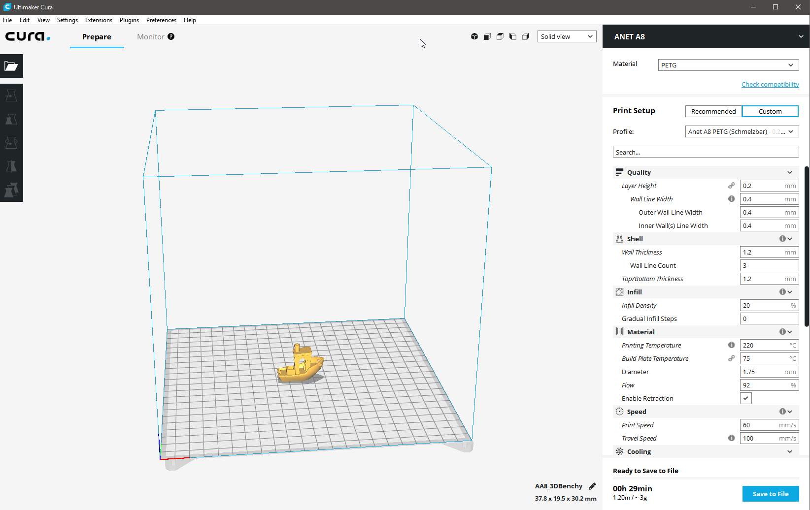
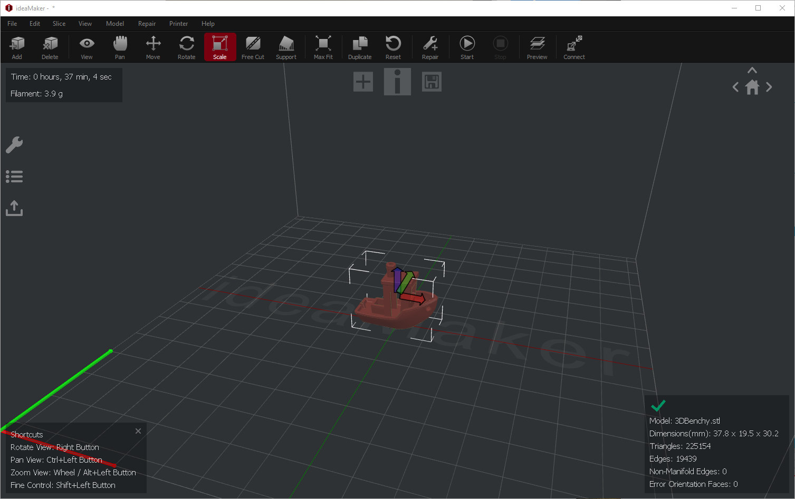
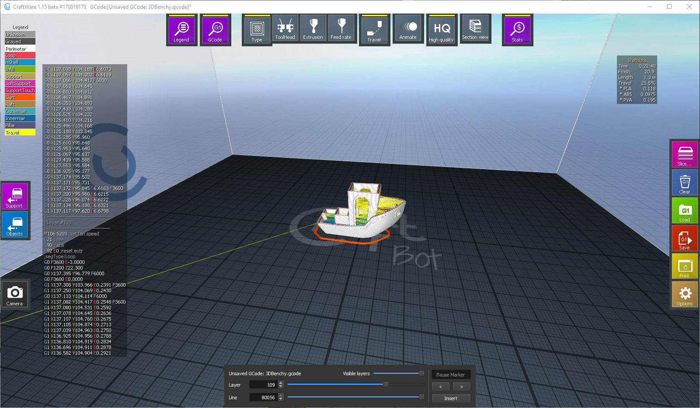
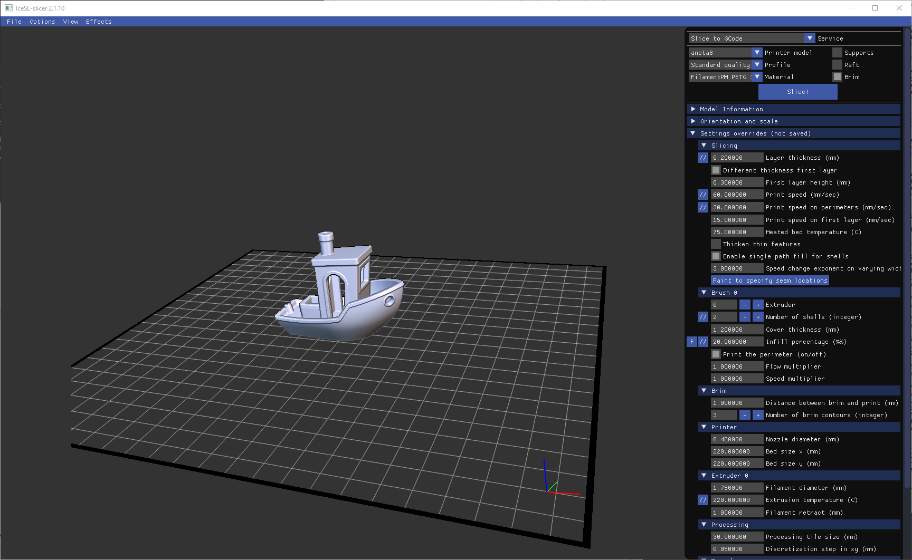
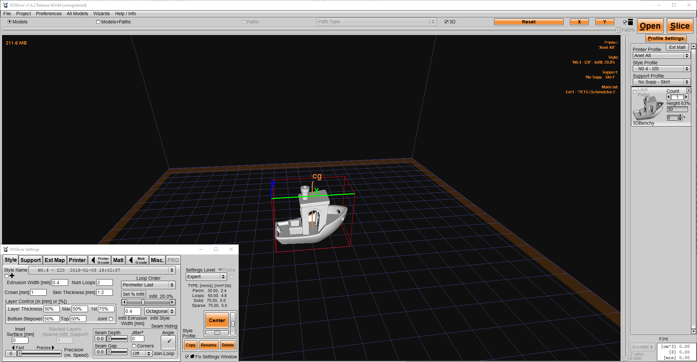
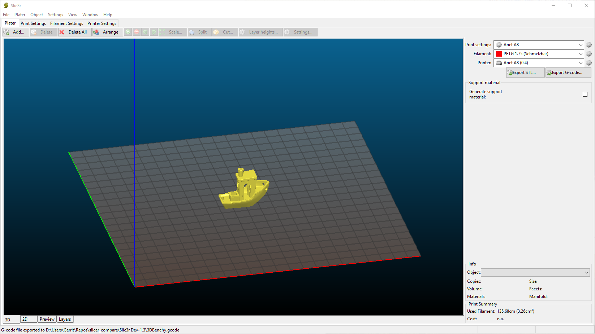
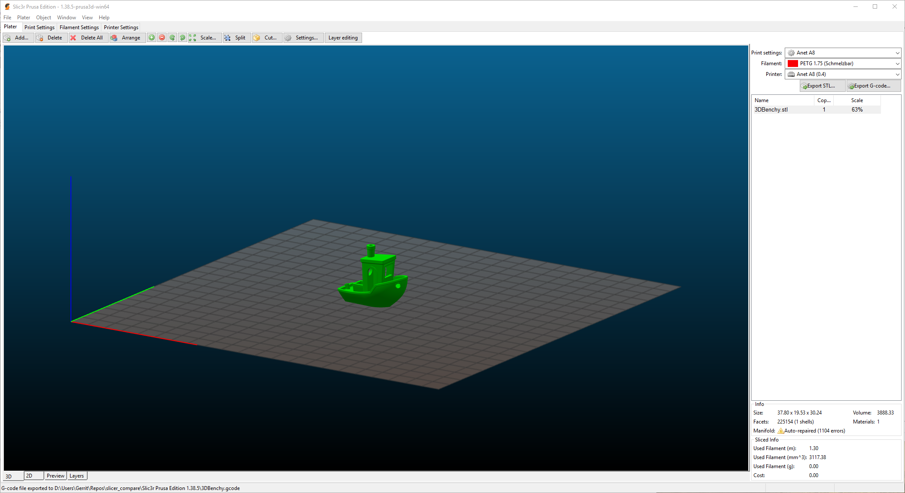

# Slicer Compare

This repository contains a small comparison of slicer software.
All tests were done with an Anet A8 without modifications beside new electronics (RAMPS 1.4 board). This is not a full blown test of each software, but a quick test of the different slicers including a small test print.

## Software
The following slicers were tested:

- [Cura 3.1](https://ultimaker.com/en/products/ultimaker-cura-software)
- [ideaMaker 2.6](https://www.raise3d.com/pages/ideamaker)
- [CraftWare 1.15](https://craftunique.com/craftware/)
- [IceSL 2.1.10](http://shapeforge.loria.fr/icesl/)
- [KISSlicer 1.6.2](http://www.kisslicer.com/)
- [Slic3r Dev-1.3](http://slic3r.org/)
- [Slic3r Prusa Edition 1.38.5](https://www.prusa3d.de/slic3r-prusa-edition/)
- [Simplify3D 4.0](https://www.simplify3d.com/) (Non-Free Software)

## Test Content
I printed a [Benchy](https://www.thingiverse.com/thing:763622) scaled to 63%. I did the scaling to speed up the print time and to intense the challenge for my printer and the slicer software.
Furthermore I tested the performance of the slicers in the following categories (three times each):

- Opening a STL
- Slicing
- Saving the G-Code

I added some comments to each slicer in none particular order or relevance. Just things which I think are worth mentioning.

## Profile Settings

*General Settings*

- Layer Height: 0.2mm
- Nozzle Diameter: 0.4mm
- Wall Thickness: 1.2mm 
- Top / Bottom Layers: 3
- Infill Density: 20%
- Material: FilamentPM PETG 220°C - Heatbed 75°C
- Fan Speed: 80% - Switched off for the first three layers
- Skirt: 3 Lines

*Speed Settings*

- Default Speed: 60mm/s
- Travel Speed: 100mm/s
- First Layer Speed: 25%
- Perimeters / Top / Bottom Speed: 50%
- Infill Speed: 125%
- Retraction Length/Speed: 3mm - 60mm/s 

Everything else remained at default. Differences in print time are possible due to automatic slow downs by some of the slicers.

## Results

### Cura 3.1  

#### Times  
The time to open a STL and the first slice time are measured together, because Cura makes the first slice instantly after adding a STL.

Open + Slice: 11.01s / 10.67s / 10.67s  
Save: Instant

#### Benchy

<blockquote class="imgur-embed-pub" lang="en" data-id="a/m5mIG"><a href="//imgur.com/a/m5mIG">View post on imgur.com</a></blockquote>

Print Time: 35min

#### Comments
Good choice for beginners. Doesn't expose to many settings in the beginning, but an experienced user is able to add/view advanced settings/properties.
All settings are saved into a single profile. Cura does not differentiate between settings for materials or other types of properties.
Relatively fast performance and easy to use UI. Time estimates can be way off, if you don't use a **Ultimaker**.

### ideaMaker 2.6

#### Times
 
Open: 1.94s / 1.11s / 1.2s  
Slice: 1.12s / 1.3s / 1.14s  
Save: Instant

#### Benchy

<blockquote class="imgur-embed-pub" lang="en" data-id="a/8EHkJ"><a href="//imgur.com/a/8EHkJ">View post on imgur.com</a></blockquote>

Print Time: 39min 

#### Comments
Model viewer was a bit laggy. Manual support structures possible.
All settings are saved into a single profile. ideaMaker does not differentiate between settings for materials or other types of properties, but the profile management is solved quite good. 

### CraftWare 1.15

#### Times

Open: Instant  
Slice: 1.16s / 1.2s / 0.76s
Save: Instant  

#### Benchy

<blockquote class="imgur-embed-pub" lang="en" data-id="a/DEQJl"><a href="//imgur.com/a/DEQJl">View post on imgur.com</a></blockquote>

Print Time: 35min  

#### Comments

Great for beginners. Every setting is explained with a description and a small animation.
Manual support structures possible. Easy to use UI and great slice preview.

### IceSL 2.1.10

#### Times
The time for slice and save are measured together, because IceSL saves the GCode directly after slicing. The slicing time depends on your created profile scripts.

Open: Instant  
Slice+Save: 1.68s / 1.62s / 1.61s

#### Benchy

<blockquote class="imgur-embed-pub" lang="en" data-id="a/KmIRa"><a href="//imgur.com/a/KmIRa">View post on imgur.com</a></blockquote>

Print Time: 33min  

#### Comments
Not for beginners or even experienced users without programming knowledge. The UI is very simple, but many of the settings are done in LUA scripting files which is not something every user wants to do. If you know how, IceSL has a very nice profile management. I think it is one of the best. IceSL comes with a feature called adaptive layering. For example it is easily possible to print a model with different layer heights or speed.

If you know how to use it, IceSL is really great!

### KISSlicer 1.6.2

#### Times

Open: 22.69s / 22.43s / 23.24s  
Slice: 11.93s / 11.25s / 11.43s  
Save: 3.46s / 3.66s / 3.42s

#### Benchy

<blockquote class="imgur-embed-pub" lang="en" data-id="a/qmtAG"><a href="//imgur.com/a/qmtAG">View post on imgur.com</a></blockquote>

Print Time: 36min  

#### Comments
KISSlicer just exposes the most common and important settings and uses default values for the remaining. UI and performance was not the best in this matchup.

### Slic3r Dev-1.3

#### Times

Open + Slice: 11.01s / 10.67s / 10.67s  
Save: 1.68s / 1.44s / 1.32s  

#### Benchy

<blockquote class="imgur-embed-pub" lang="en" data-id="a/q7tJ1"><a href="//imgur.com/a/q7tJ1">View post on imgur.com</a></blockquote>

Print Time: 28min  

#### Comments
Many options could confuse beginners, but are great for experienced users. Users are able to create profiles for materials, printers and print settings.

### Slic3r Prusa Edition 1.38.5

#### Times

Open + Slice: 4.38s / 3.91s / 4.01s  
Save: 1.06s / 0.92s / 1.01s  

#### Benchy

<blockquote class="imgur-embed-pub" lang="en" data-id="a/5lhVH"><a href="//imgur.com/a/5lhVH">View post on imgur.com</a></blockquote>

Print Time: 28min  

#### Comments
Many options could confuse beginners, but are great for experienced users. Users are able to create profiles for materials, printers and print settings.
Provides a feature similar to IceSLs 'adaptive layering'. Better performance than the "original" Slic3r.

### Simplify3D 4.0

#### Times

Open: Instant
Slice: 1.13s / 0.97s / 1.02s
Save: Instant

#### Benchy

<blockquote class="imgur-embed-pub" lang="en" data-id="a/rs0Qa"><a href="//imgur.com/a/rs0Qa">View post on imgur.com</a></blockquote>

Print Time: 43min

#### Comments
Very good performance. Manual supports possible, nice handlig of different settings for different models or layers in you print - called processes. Only non-free slicer on this list. I think it is a bit pricey. The other slicers are also able to produce very good results and they are free!